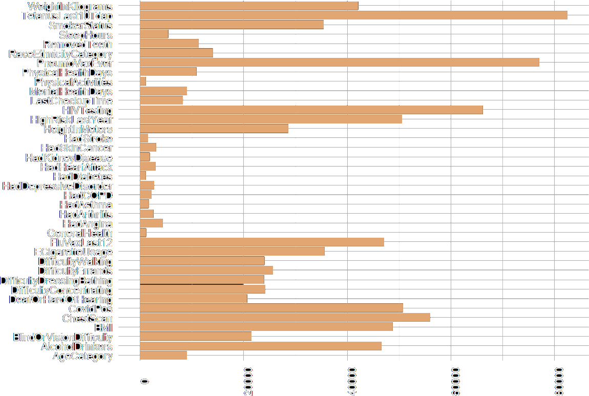

# Data Mining Final Project

**GROUP 2: CLAUDE SHANNON**

---

## Authors

- Garri Romzova, Antonio
- Mayol Matos, Sergi
- Medina Perelló, Alejandro
- Palmer Perez, Ruben
- Rodríguez Arguimbau, Alejandro

---

## Index

1. Objective
2. Dataset
3. Considerations left behind
4. Conclusions

---

# Objective

_A common goal_

---

# Dataset

_An exploratory introduction_

---

## Context

Medical data around the US regarding health metrics

---

## Observations

**Over 400k**

_counting duplicated data_

---

## Variables

Most of them are categorical or _Boolean_, e.g.

- `HadSkinCancer`
- `HadDepressiveDisorder`
- `SmokerStatus`
- Etc

---

Only six variables are numeric:

- `PhysicalHealthDays`
- `MentalHealthDays`
- `SleepHours`
- `HeightInMeters`
- `WeightInKilograms`
- `BMI`

---

## Missing data

_that's a lot_

---

# Data modifications

_To use the least amount of variables_

---

## BMI

$$BMI=\frac{Weight}{Height^2}$$

Remove `Height` and `Weight` and fill up non-numeric values, applying the formula

---

| **Classification** | **BMI Score** |
| ------------------ | ------------- |
| Underweight        | < 18.5        |
| Normal             | 18.5 - 24.9   |
| Overweight         | 25.0 - 29.0   |
| Obese              | 30.0 - 40.0   |
| Extreme Obese      | > 40.0        |

---

## How to fill missing data

---

# Conclusions

---
